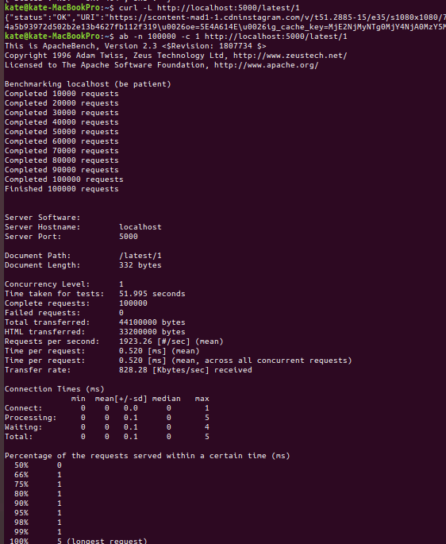
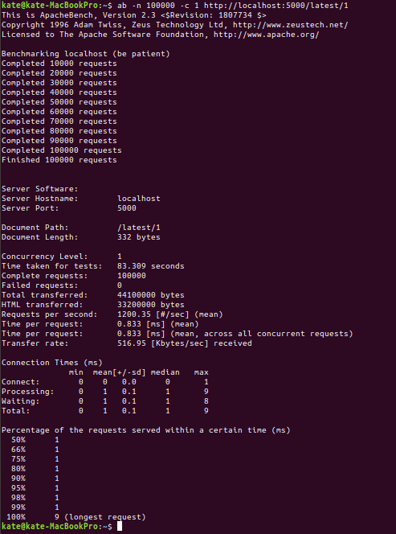

# Despliegue de máquina virtual con Vagrant en Azure. 🇻

## En qué consiste la práctica

La práctica consiste en usar una Infraestructura como servicio (IaaS), cargarle un sistema operativo, provisionar (hecho en la práctica anterior) y hacer que todo funcione al acceder a la dirección de nuestra máquina.

## Por qué Vagrant 🤔

Se ha usado Vagrant porque con él podemos crear una máquina de VirtualBox por línea de comandos y es integrable con otros sistemas para provisionado, en concreto Ansible.

Esto hace reproducible de forma automática la creación de máquinas virtuales.

## Por qué Azure 🤔

De otra práctica anterior vi que era sencillo de configurar y tenía créditos. 

No me ha gustado porque la línea de comandos no es expresiva a veces con los errores y no sabes qué pasa o no es suficientemente clara.

## Qué se ha hecho 🤷‍♂️

Se ha instalado el CLI de Azure, el plugin de Azure para Vagrant y se ha adaptado el Vagrantfile para las necesidades Azure.

## Vagrantfile

Principalmente he usado este enlace para entender lo que había que hacer: https://blog.scottlowe.org/2017/12/11/using-vagrant-with-azure/

El Vagrantfile comienza con la máquina que vamos a necesitar y se especifica en esta orden:

    config.vm.box = 'azure'

"azure" es una dummy box a la que se le cargará después la imagen de SO que queramos.

Para descargar la dummy box se hace esta otra orden:

    vagrant box add azure https://github.com/msopentech/vagrant-azure/raw/master/dummy.box

Hay que especificar los puertos de envío desde fuera hacia dentro:

    config.vm.network "forwarded_port", guest: 5000, host: 5000
  
y también la ubicación de la clave privada en tu equipo local para cuando te conectes por ssh:

      config.ssh.private_key_path = '~/.ssh/id_rsa'

Ahora viene la configuración específica de Azure:

    config.vm.provider "azure" do |az, override|
        # Cogemos variables de entorno necesarias. Hay que hacer export antes de esto
        az.tenant_id = ENV['AZURE_TENANT_ID']
        az.client_id = ENV['AZURE_CLIENT_ID']
        az.client_secret = ENV['AZURE_CLIENT_SECRET']
        az.subscription_id = ENV['AZURE_SUBSCRIPTION_ID']
        
        # Specify VM parameters
        # NOmbre de la máquina virtual que queremos crear
        az.vm_name = 'goapp'
        
        # "Tamaño" de los recursos virtuales . Probé la B1ls (1 cpu y 500mb de RAM)
        # pero se quedaba corta de ram al provisionar y tuve que volver a esta que es la
        # más barata después de esa.
        az.vm_size = 'Standard_B1s'
        
        # La localización de nuestra máquina es importante si queremos 
        # cumplir con la normativa europea de protección de datos.
        # Debe ser la misma del grupo de recursos, si no fallará. (az group create -l westeurope -n goinsta2)
        az.location = 'westeurope'
        
        # La imagen a usar es Ubuntu Server 18.04 porque es la versión que uso en local y con la que se testeaba, además de ser de soporte extendido
        az.vm_image_urn = 'Canonical:UbuntuServer:18.04-LTS:latest'
        
        # Grupo de recursos donde se engloba esta máquina. (ya debe de haber sido creado)
        # Se crea con esta orden: az group create -l westeurope -n goinsta2
        az.resource_group_name = 'goinsta2'

        # Punto de entrada de nuestra app. Esta orden abre el puerto en el cortafuegos
        # y une el exterior con nuestra máquina.
        # (al principio creía que no era necesario y probé a abrir puertos directamente en el portal de Azure, pero
        # parece que es obligatorio)
        az.tcp_endpoints='5000'
    end

La parte de provisionamiento es igual que en el anterior hito:

    config.vm.provision "ansible_local" do |ansible|
        ansible.playbook = "despliegue/playbook.yml"
        ansible.verbose = true
    end

## Anécdota (VM con Vagrant vs Docker)

    Nota mental: Queda pendiente usar un balanceador de carga y testearlo en Docker.

Un dato que quería comentar es que como me gusta el tema de balanceo de carga en servidores, hice una prueba con Apache Benchmark entre una instancia Docker en local y una con Vagrant.

Lo curioso es que Docker, cuya imagen ocupa apenas 6 megas, es algo más lenta que la máquina virtual creada con Vagrant.

En un primer momento pensé que podía ser por diferencia de recursos que se le diesen a uno y otro por defecto pero, según consulté, los tienen "ilimitados" con el sistema operativo anfitrión.

Quizás la clave esté en que escalar varias máquinas con Docker sea más rápido y, por tanto, más barato en sistemas en la nube donde se te cobra por uso. Aparte, la diferencia de tiempos en arrancar un nuevo contenedor Docker y una máquina completa de Vagrant y provisionar puede ser de 3 o 4 minutos fácilmente, con lo cual, en una situación de alta demanda puntual, estaríamos un poco vendidos. Por tanto el balanceo de carga queda suficientemente justificado y se ve que su uso no es "por gusto" aunque en un sistema estándar parezca que no haga falta.

En las siguientes capturas vemos los tiempos y la información de Apache Benchmark.

Apache benchmark sobre una máquina de Vagrant:

Apache benchmark sobre un Docker:

